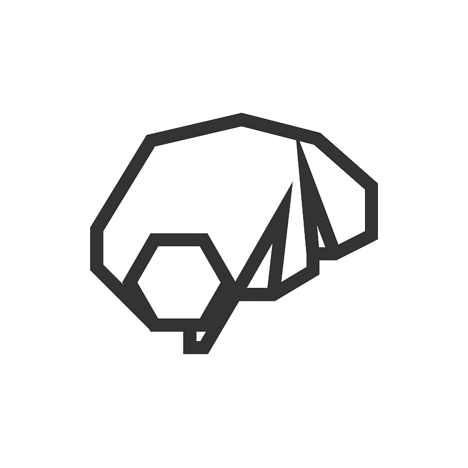

<p align="center"> 
    
</p>

<h1 align="center">
Immortal
</h1>

<br/>


The Immortal is a [Nostr](https://nostr.com) relay implementation in Golang.

Immortal aimed and designed to be **scalable**, **high-performance**, and **configurable**. It's a good choice for paid relays or big community relays and not a good choice for a personal relay.

## Supported NIPs

You can find supported NIPs details [here](./documents/NIPs.md).

## Updates

Updates, changes, or community discussions can be followed on the GitHub issue/discussion or the [Dezh Technologies Nostr profile](https://njump.me/dezh.tech).

## Contribution

All kinds of contributions are welcome!
Read the [Contribution guides](./CONTRIBUTING.md) before any code contribution.

## Donation

Donations and financial support for the development process are possible using Bitcoin and Lightning:

**on-chain**:

```
bc1qa0z44j7m0v0rx85q0cag5juhxdshnmnrxnlr32
```

**lightning**: 

```
dezh@coinos.io
```

## License

The Immortal software is published under the [MIT License](./LICENSE) and contributing and using this code means you agree with the license.
